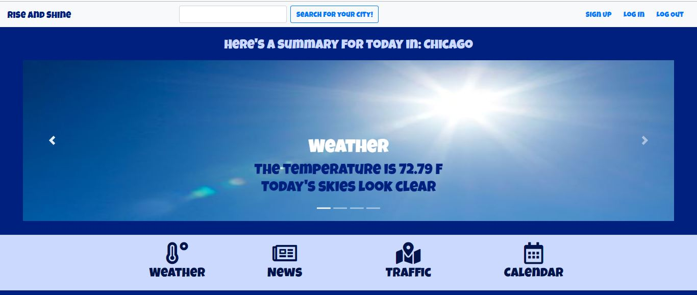
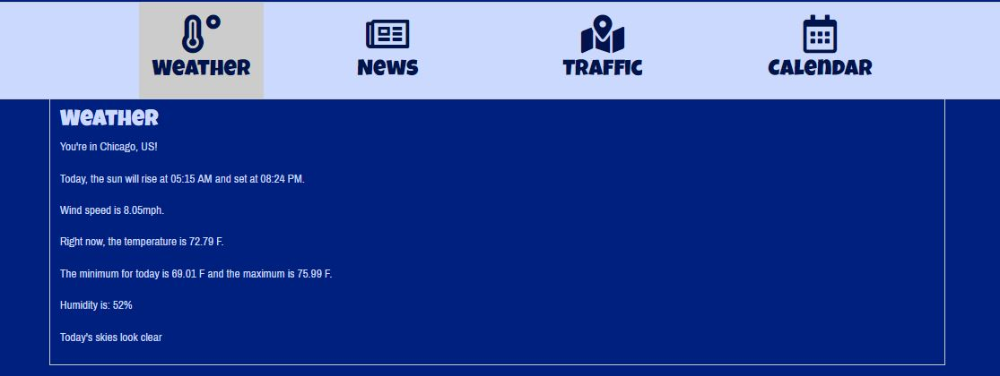
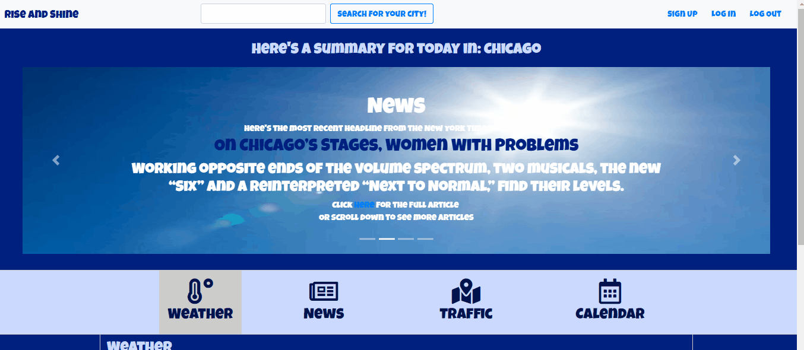

<h1>Rise and Shine App</h1>

Use the Rise and Shine app as a "one-stop shop" to easily plan your day. This app is perfect for situations when you're in a hurry in the morning, for example.

Instead of having to access different websites before leaving the house, you can now access the Rise and Shine app to obtain news related to your area, as well as data related to traffic and the weather. You are able to plan ahead what to wear and when to leave your home.

Besides being able to check weather, traffic and news, the Google login feature was also incorporated in the app. If you decide to sign in using this feature, your Google calendar will also be displayed. This way, you can check what meetings or appointments you have scheduled to that day.

Release 1.0 Minimum Viable Product (MVP):

This app is deployed at https://rise-shine.firebaseapp.com/.

<h2>Using the Rise and Shine App</h2>

<h3>Allowing Geolocation</h3>

1. Go to https://rise-shine.firebaseapp.com/.

2. If geolocation is compatible with your browser, you'll be asked if you allow the app to read your location. 

3. By clicking allow, the app will automatically get your location and let you know the news, traffic patterns and weather forecast for the day in your area.

4. To view more details about one of the topics above, click the navbar right below the carousel:

<h3>Searching for a new location/Denying Geolocation</h3>

You can also search for a new location using the Search bar at the top of the page. Search for the city you'd like to check and click the "Search for your city!" button:

<h3>Signing Up</h3>

It's possible to sign up for the app so that you receive news customized to your interests. To do so, simply click Sign Up and fill out the required form.

<h3>Enabling the Calendar View</h3>

If you have a Gmail account, you can also use the Rise and Shine app to manage your calendar. To do so, open the app and select Log In.

Enter your Gmail address and press Google Login.

<h2>MVP - How the App was developed</h2>

This app was created in a collaboration between Amanda L. Ragone, Halon J. Hamilton, Jake Smith, Mike Garringer and Troy Fasnacht.

<h3>Release 1.0</h3>

**Phase One:** Select the APIs that will be used in the Project.

**Phase Two:** Make the calls as to how to make the API calls and which logic to use.

**Phase Three:** Integrate all the APIs.

**Phase Four:** Style the page and create a readme file.

<h2>Project Management</h2>

[Project Board](https://github.com/rise-shine/Project1/projects/1)

<h2>Future Direction</h2>
- Fix bugs related to the Calendar View.
- Improve how news are selected.

